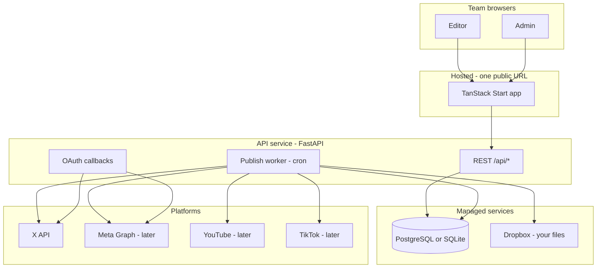
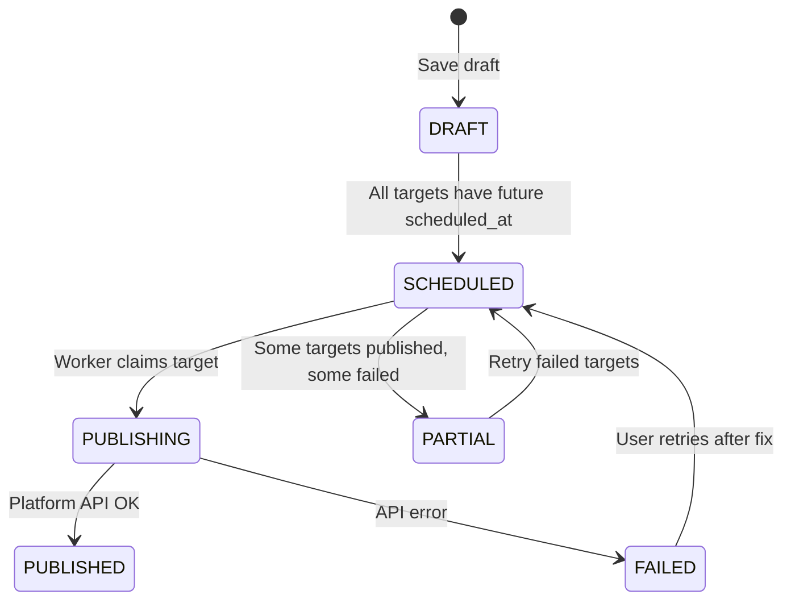
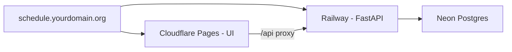

# TORCC OmniSocial Scheduler — Complete Project Layout

**Repo:** [glance-schedule-go](https://github.com/EvenSteven92/glance-schedule-go)  
**Product name (UI):** TORCC OmniSocial Scheduler  
**Audience:** Small team (TORCC / ministry social workflow)  
**Media strategy:** Dropbox share links (no app-owned video storage in v1)

This document is the single blueprint for what exists today, what we are building toward, and how the pieces connect.

---

## 1. Product in one paragraph

A team opens one web app to **compose** posts for X, Meta, YouTube, TikTok, and Stories, **paste a Dropbox link** to the reel/video already stored there, **schedule** per-platform times (with optional AI copy + peak-time suggestions), and have a **background worker publish** when due. Analytics and dashboard metrics start as **optional** (platform APIs later); scheduling and publish are **required** for “live.”

---

## 2. What exists today vs target

| Layer | Today | Target (live) |
|-------|--------|----------------|
| UI shell | ✅ Built (Lovable / TanStack Start) | Keep; wire to API |
| Post data | ❌ `mock-data.ts` only | Database |
| Media | ❌ Filename / bulk-upload UI only | Dropbox URL per post |
| Publish | ❌ “Schedule” marks card locally | Cron + platform APIs |
| Team auth | ❌ Sign out button (no-op) | Login + workspace |
| Analytics | ❌ Mock charts | Phase 2: platform insights APIs |
| AI copy | ⚠️ Backend route; needs Emergent key locally | Keep or swap to xAI/Grok later |
| News ticker | ⚠️ Real RSS when backend runs | Keep |

---

## 3. System architecture (live)



**Plain English:** Browsers talk to your **website**. The website talks to your **API**. The API reads/writes a **database** and, when it is time to post, fetches media from **Dropbox** and calls **X / Meta / etc.** You do not run a server in your living room; you rent small managed pieces.

---

## 4. Repository layout

```
glance-schedule-go/
├── docs/
│   └── PROJECT_LAYOUT.md          ← this file
├── memory/
│   └── PRD.md                     ← historical setup notes
├── README.md                      ← local dev quick start
│
├── frontend/                      ← TanStack Start + React 19
│   ├── src/
│   │   ├── routes/                ← pages (file-based routing)
│   │   │   ├── __root.tsx         ← shell: sidebar + news ticker
│   │   │   ├── index.tsx          ← Dashboard
│   │   │   ├── scheduler.tsx      ← Compose + bulk + AI schedule
│   │   │   ├── calendar.tsx       ← Calendar view
│   │   │   └── analytics.tsx      ← Analytics view
│   │   ├── components/
│   │   │   ├── Sidebar.tsx
│   │   │   ├── PageHeader.tsx
│   │   │   ├── NewsTicker.tsx
│   │   │   ├── TimeframeSelector.tsx
│   │   │   └── post/
│   │   │       ├── ComposerCard.tsx
│   │   │       ├── PostCard.tsx
│   │   │       ├── PlatformRow.tsx
│   │   │       ├── PlatformPreview.tsx
│   │   │       └── CharCounters.tsx
│   │   └── lib/
│   │       ├── mock-data.ts       ← REMOVE usage as API lands
│   │       ├── platforms.ts       ← platform rules (keep)
│   │       ├── conflicts.ts       ← schedule conflict detection
│   │       ├── timeframe.ts       ← dashboard timeframe math
│   │       ├── ai-client.ts       ← POST /api/ai/generate
│   │       └── api/               ← PLANNED: typed API client
│   │           ├── client.ts
│   │           ├── posts.ts
│   │           ├── accounts.ts
│   │           └── auth.ts
│   └── vite.config.ts             ← dev proxy /api → :8001
│
└── backend/                       ← FastAPI (name says "go"; stack is Python)
    ├── server.py                  ← app entry (split into modules later)
    ├── requirements.txt
    ├── .env                       ← secrets (not in git)
    ├── db/                        ← PLANNED
    │   ├── models.py              ← SQLAlchemy or SQLModel
    │   └── session.py
    ├── routes/                    ← PLANNED
    │   ├── auth.py
    │   ├── workspaces.py
    │   ├── posts.py
    │   ├── accounts.py
    │   ├── dropbox.py
    │   └── internal.py            ← cron publish endpoint
    ├── services/                  ← PLANNED
    │   ├── dropbox_links.py       ← share URL → direct URL
    │   ├── publish_x.py
    │   ├── publish_meta.py        ← phase 2+
    │   └── scheduler.py           ← due posts query + dispatch
    └── workers/                   ← PLANNED (or same process + cron)
        └── publish_loop.py
```

**Note:** PRD mentioned `/ai-studio`; that route is **not** in the repo. AI actions live **inside** `ComposerCard` (caption, hashtags, YT title/desc). No separate AI Studio page unless you add one later.

---

## 5. Supported platforms

| Code | Product | Formats (UI) | Publish v1 | Publish later |
|------|---------|--------------|------------|---------------|
| X | X / Twitter | landscape, portrait | **Yes (MVP)** | |
| FB | Facebook | landscape, portrait | | Phase 2 |
| IG | Instagram | landscape, portrait | | Phase 2 |
| YT | YouTube | landscape, portrait | | Phase 2 |
| RUMBLE | Rumble | landscape, portrait | | Phase 2 (metrics API limited — see note below) |
| YT SHORTS | YouTube Shorts | portrait | | Phase 3 |
| TIKTOK | TikTok | portrait | | Phase 3 |
| IG STORY | Instagram Story | story | | Phase 3 |
| FB STORY | Facebook Story | story | | Phase 3 |

Platform metadata (icons, peak times, format rules) stays in `frontend/src/lib/platforms.ts`. Backend stores the same short codes on each **post target**.

**Rumble note:** Rumble is in the UI and mock analytics today. There is no public OAuth/analytics API comparable to YouTube or Meta for third-party schedulers; live metrics in production may require Rumble partner tools, manual CSV, or unofficial data sources until they expose creator APIs.

---

## 6. Data model

### 6.1 Core entities

```
User
  id, email, password_hash, name, created_at

Workspace                    # one TORCC team space
  id, name, slug, invite_code, created_at

WorkspaceMember
  workspace_id, user_id, role (OWNER | MEMBER)

ConnectedAccount             # OAuth per platform per workspace
  id, workspace_id, platform (X | FB | ...)
  external_user_id, username
  access_token_enc, refresh_token_enc, expires_at

Post                         # one creative / campaign unit
  id, workspace_id, created_by_id
  title, caption, hashtags, transcript (optional)
  dropbox_url, dropbox_direct_url (cached)
  media_kind (image | video), format (landscape | portrait | story)
  status (DRAFT | SCHEDULED | PARTIAL | PUBLISHED | FAILED)
  created_at, updated_at

PostTarget                   # one row per platform instance of a post
  id, post_id, platform, connected_account_id
  scheduled_at (UTC)
  status (SCHEDULED | PUBLISHING | PUBLISHED | FAILED)
  external_post_id, error_message, published_at

AuditLog (optional v1)
  post_id, actor_id, action, detail, created_at
```

### 6.2 Post lifecycle



### 6.3 Dropbox fields on `Post`

| Field | Purpose |
|-------|---------|
| `dropbox_url` | What the user pasted (`dropbox.com/s/...` or `dropbox.com/scl/fi/...`) |
| `dropbox_direct_url` | Resolved `dl=1` (or API) URL for workers/platforms; refreshed if link rot |

**Team convention (recommended):**

- One folder per week or series (e.g. `Reels/2026-06/`)
- Share link: **anyone with the link** (for automated fetch)
- Do not move/delete file after scheduling without updating the post

---

## 7. API surface (target)

Base path: `/api` (same origin in production via reverse proxy).

### Auth & team

| Method | Path | Description |
|--------|------|-------------|
| POST | `/auth/register` | First user + workspace (or invite-only later) |
| POST | `/auth/login` | Session cookie / JWT |
| POST | `/auth/logout` | Clear session |
| GET | `/workspaces/me` | Current workspace + role |
| POST | `/workspaces/invite/join` | Join via `invite_code` |

### Connected accounts

| Method | Path | Description |
|--------|------|-------------|
| GET | `/accounts` | List connected platforms for workspace |
| GET | `/accounts/x/connect` | Redirect to X OAuth |
| GET | `/accounts/x/callback` | OAuth callback, store tokens |
| DELETE | `/accounts/{id}` | Disconnect |

### Posts

| Method | Path | Description |
|--------|------|-------------|
| GET | `/posts` | List (filter: status, date range) |
| POST | `/posts` | Create draft |
| GET | `/posts/{id}` | Detail + targets |
| PATCH | `/posts/{id}` | Update caption, dropbox_url, etc. |
| DELETE | `/posts/{id}` | Delete draft / cancel scheduled |
| POST | `/posts/{id}/targets` | Add/update platform rows + `scheduled_at` |
| POST | `/posts/{id}/schedule` | Validate → `SCHEDULED` |
| POST | `/posts/{id}/publish-now` | Immediate publish (optional) |

### Dropbox helper

| Method | Path | Description |
|--------|------|-------------|
| POST | `/dropbox/resolve` | Body: `{ url }` → `{ direct_url, media_kind?, ok }` |

### AI (existing, keep)

| Method | Path | Description |
|--------|------|-------------|
| POST | `/ai/generate` | caption, hashtags, yt_desc, yt_title, internal_notes |

### News (existing, keep)

| Method | Path | Description |
|--------|------|-------------|
| GET | `/news/headlines` | RSS aggregator |

### Internal / ops

| Method | Path | Description |
|--------|------|-------------|
| GET | `/health` | Health + config flags |
| POST | `/internal/publish-due` | Cron: `Authorization: Bearer CRON_SECRET` |

---

## 8. Frontend map

### 8.1 Routes (current → data source)

| Route | Page | Today | Target |
|-------|------|-------|--------|
| `/` | Dashboard | `mock-data.ts` | `GET /posts` + analytics API (phase 2) |
| `/scheduler` | New post / bulk compose | Local React state | `POST /posts`, Dropbox field |
| `/calendar` | Month/week view | Mock | `GET /posts?from=&to=` |
| `/analytics` | Charts | Mock | Platform insights (phase 2) |

### 8.2 Scheduler page flow (target)

1. **Bulk add** — paste multiple Dropbox links OR pick files (metadata only; link required for publish).
2. **ComposerCard** per item — caption, hashtags, platforms, previews, char counters.
3. **AI buttons** — call `/api/ai/generate` (unchanged).
4. **Generate optimal schedule** — client-side peak windows (`platforms.ts`) → write `proposedTimes` → save as `PostTarget.scheduled_at`.
5. **Schedule post** — `POST /posts/{id}/schedule`.
6. **Conflict warnings** — keep `conflicts.ts` (same author, overlapping times).

### 8.3 Dashboard (target)

- **Scheduled queue** — `status=SCHEDULED`, next 7 days.
- **Draft queue** — `status=DRAFT`.
- **Failed** — visible with error + retry.
- **Growth matrix** — mock until insights APIs exist; show “Connect accounts for live stats.”

### 8.4 Settings (planned route)

| Route | Purpose |
|-------|---------|
| `/settings/accounts` | Connect X / Meta / YT |
| `/settings/team` | Invite code, members (OWNER) |
| `/settings/workspace` | Name, timezone default |

Sidebar today has no Settings; add when OAuth exists.

---

## 9. Publish worker

Runs every **1 minute** (host cron or platform scheduler hitting `/internal/publish-due`).

```
1. SELECT post_targets WHERE status = SCHEDULED AND scheduled_at <= now()
2. FOR each target (limit batch size):
     a. SET status = PUBLISHING
     b. Load post.dropbox_direct_url (resolve if missing)
     c. SWITCH platform:
          X  → publish_x (text now; media when API allows)
          FB → publish_meta (phase 2)
          ...
     d. ON success → PUBLISHED + external_post_id
     e. ON failure → FAILED + error_message
3. Recompute parent Post.status (all published → PUBLISHED, mix → PARTIAL)
```

**MVP:** X text tweets first; X video with Dropbox fetch when you need it. Reels to IG/TikTok often require download-then-upload (worker memory/time limits — document max file size).

---

## 10. Security & secrets

| Secret | Where | Used for |
|--------|-------|----------|
| `DATABASE_URL` | Backend | Postgres (prod) / SQLite (local) |
| `SESSION_SECRET` or `JWT_SECRET` | Backend | Auth cookies |
| `ENCRYPTION_KEY` | Backend | Encrypt OAuth tokens at rest |
| `X_CLIENT_ID`, `X_CLIENT_SECRET` | Backend | X OAuth + API |
| `X_REDIRECT_URI` | Backend | OAuth callback URL |
| `CRON_SECRET` | Backend | Protect publish endpoint |
| `EMERGENT_LLM_KEY` | Backend | AI generate (optional) |
| Dropbox | **No app key required for v1** | Public share links only |

Never commit `.env`. Team users never see platform refresh tokens.

---

## 11. Deployment layout (simple)

Recommended for low ops (no server babysitting):

| Piece | Suggested host | Why |
|-------|----------------|-----|
| Frontend static/SSR | **Cloudflare Pages** or Vercel | Git push → deploy |
| API + worker | **Railway**, **Fly.io**, or **Render** | Runs FastAPI + cron in one service |
| Database | **Neon** or **Supabase** (Postgres) | Managed, backups |
| Media | **Dropbox** (your account) | Already paid / in use |
| Domain | `schedule.torcc.org` (example) | DNS → Pages; `/api` → API host |

**Monthly cost ballpark (small team):** $0–25 for DB + API hobby tiers; $0 extra for media if Dropbox-only.



---

## 12. Implementation phases

### Phase 0 — Done / in progress

- [x] UI shell (dashboard, scheduler, calendar, analytics)
- [x] Local dev (frontend + backend + `/api` proxy)
- [x] AI + news endpoints (backend)
- [x] Project layout doc (this file)

### Phase 1 — “Real scheduler” (MVP live)

- [ ] Postgres schema + migrations
- [ ] Auth + one workspace + invite code
- [ ] CRUD posts + post_targets
- [ ] Dropbox URL field + `/dropbox/resolve`
- [ ] X OAuth + connect UI
- [ ] Publish worker + X text publish
- [ ] Replace mock data on dashboard + calendar
- [ ] Deploy to staging URL

### Phase 2 — Team + more platforms

- [ ] Roles (OWNER vs MEMBER)
- [ ] Meta (FB + IG) OAuth + publish
- [ ] YouTube upload/scheduling
- [ ] Failed post retry UI
- [ ] Settings pages in sidebar

### Phase 3 — Polish

- [ ] Real analytics (per-platform insights)
- [ ] TikTok + Stories
- [ ] Optional Dropbox API folder picker
- [ ] Notifications (email/Slack on failure)

---

## 13. Environment: local vs production

| | Local | Production |
|--|-------|------------|
| UI | http://localhost:3000 | https://your-domain |
| API | http://127.0.0.1:8001 | https://api.your-domain or `/api` proxy |
| DB | `file:./dev.db` (SQLite) | Postgres URL |
| X OAuth redirect | `http://localhost:8001/api/accounts/x/callback` | `https://api.../...` |
| Cron | Manual `curl` or `while sleep 60` | Host cron every minute |

---

## 14. Open decisions (you can answer anytime)

1. **Timezone** — Store everything UTC; show America/New_York in UI?
2. **Invite-only** — Public registration off; only `invite_code`?
3. **AI provider** — Keep Emergent LLM vs switch to Grok/xAI for captions?
4. **Analytics v1** — Hide page until real, or keep mock with banner?
5. **X MVP** — Text-only first vs video-from-Dropbox on day one?

---

## 15. Quick reference: who owns what file today

| Concern | File(s) |
|---------|---------|
| Fake posts/metrics | `frontend/src/lib/mock-data.ts` |
| Platform rules | `frontend/src/lib/platforms.ts` |
| Compose UI | `frontend/src/routes/scheduler.tsx`, `ComposerCard.tsx` |
| AI calls | `frontend/src/lib/ai-client.ts` → `backend/server.py` |
| News ticker | `NewsTicker.tsx` → `/api/news/headlines` |
| API entry | `backend/server.py` (split into `routes/` later) |

---

*Last updated: 2026-06-04 — aligns with team + X publish MVP, Dropbox media, no paid object storage in v1.*